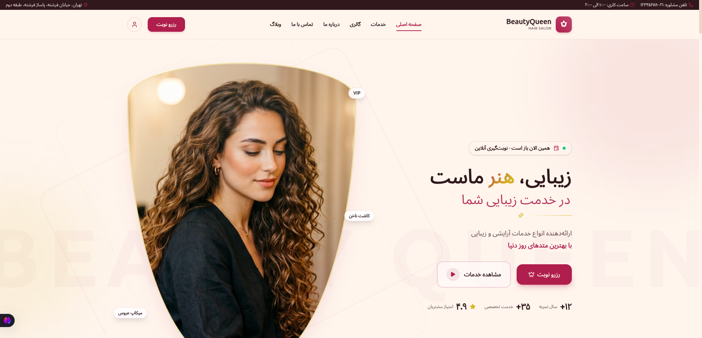
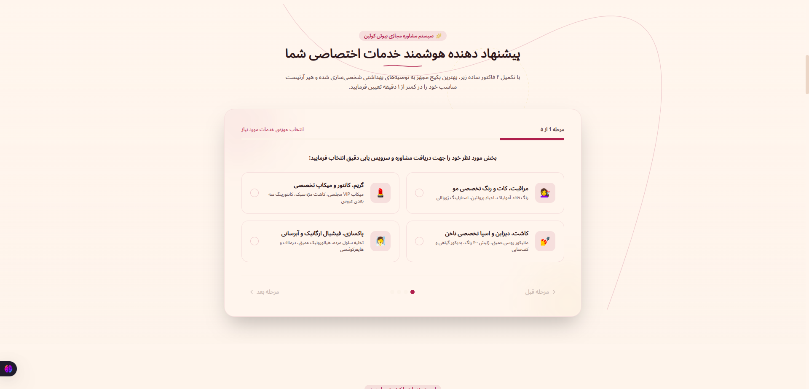
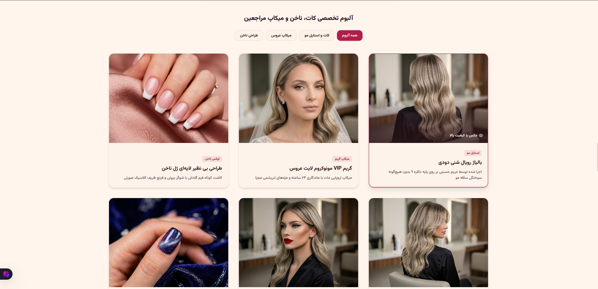
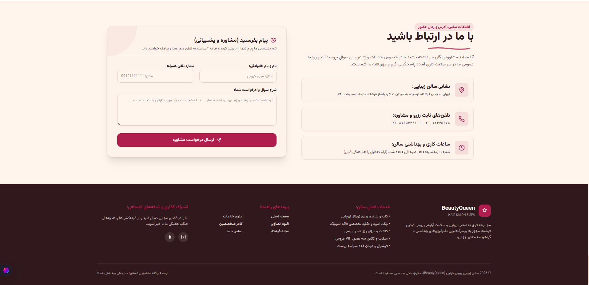

# 💎 BeautyQueen — Luxury Beauty Salon Platform

> A modern, full-featured beauty salon website for **BeautyQueen Hair Salon & Spa** — built with React, TypeScript, and Tailwind CSS.  
> Persian (RTL) UI · Online booking · Smart service recommender · Portfolio gallery · Customer reviews

---

## 📸 Screenshots

### 🏠 Homepage — Hero & Brand Experience



*Animated hero section with parallax scrolling, live booking badge, service highlights, and trust statistics.*

---

### 🧠 Smart Service Recommender



*5-step personalized consultation wizard that matches clients with the right service and specialist.*

---

### 🖼️ Portfolio Gallery



*Filterable portfolio grid showcasing hair, makeup, and nail work — plus an interactive before/after slider.*

---

### 📬 Contact & Footer



*Contact form, salon info cards, and a luxurious multi-column footer with navigation and social links.*

---

## ✨ Features

| Feature | Description |
|---------|-------------|
| 🎨 **Luxury RTL Design** | Warm cream & berry palette, Vazirmatn typography, gold accents, glass-morphism cards |
| 📅 **Online Booking** | 4-step modal flow: service → specialist → date/time → contact details |
| 🎯 **Smart Recommender** | Rule-based 5-step wizard maps preferences to services & staff |
| 💇 **Services Catalog** | 13 services across hair, makeup, nail & skin — searchable & filterable |
| 🖼️ **Gallery** | Category filters + drag-to-compare before/after slider |
| 👩‍🎨 **Staff Profiles** | 5 specialists with ratings, roles, and specialties |
| ⭐ **Reviews** | Customer testimonials with star ratings; users can submit new reviews |
| 📰 **Beauty Blog** | 3 articles with full content modal (makeup, hair care, skincare) |
| 📞 **Contact Form** | Inquiry form with address, phone, and working hours |
| 👤 **User Profile** | Mock OTP login, booking history, cancel appointments, leave reviews |
| 📱 **Responsive** | Mobile hamburger menu, adaptive grids, touch-friendly interactions |
| 🎬 **Animations** | Page transitions, scroll parallax, staggered reveals via Motion |

---

## 🛠️ Tech Stack

| Layer | Technology |
|-------|------------|
| ⚛️ Framework | [React 19](https://react.dev/) |
| ⚡ Build Tool | [Vite 6](https://vitejs.dev/) |
| 📘 Language | [TypeScript 5.8](https://www.typescriptlang.org/) |
| 🎨 Styling | [Tailwind CSS 4](https://tailwindcss.com/) |
| 🌀 Animation | [Motion](https://motion.dev/) |
| 🎯 Icons | [Lucide React](https://lucide.dev/) |
| 💾 Persistence | Browser `localStorage` |
| 🔤 Font | [Vazirmatn](https://github.com/rastikerdar/vazirmatn) (Google Fonts) |

---

## 📁 Project Structure

```
Beauty-Queen/
├── index.html                 # HTML entry (RTL, Persian lang)
├── package.json
├── vite.config.ts             # Vite + React + Tailwind plugins
├── tsconfig.json
├── .env.example               # Environment variable template
│
└── src/
    ├── main.tsx               # React root mount
    ├── App.tsx                # Tab routing, modals, footer, state
    ├── index.css              # Tailwind theme & custom utilities
    ├── types.ts               # Service, Staff, Booking, Review, BlogPost
    ├── data.ts                # Static salon data (services, staff, blog, reviews)
    │
    ├── components/
    │   ├── Navbar.tsx         # Sticky header + mobile menu
    │   ├── Hero.tsx           # Landing hero with parallax
    │   ├── ServiceRecommender.tsx  # 5-step consultation wizard
    │   ├── ServicesSection.tsx     # Searchable service catalog
    │   ├── GallerySection.tsx      # Portfolio + before/after slider
    │   ├── StaffSection.tsx        # Specialist team cards
    │   ├── ReviewsSection.tsx      # Customer testimonials
    │   ├── BlogSection.tsx         # Beauty magazine articles
    │   ├── ContactSection.tsx      # Contact form & info
    │   ├── BookingModal.tsx        # Multi-step appointment booking
    │   └── AuthModal.tsx           # Login, bookings, review submission
    │
    └── assets/images/
        ├── screen1–4.png      # README screenshots
        └── img1–13.png        # Gallery, hero & blog images
```

---

## 🌐 Live Demo (GitHub Pages)

**https://code1sprint.github.io/Beauty-Queen/**

Deployed automatically via GitHub Actions on every push to `main`.

### GitHub Pages Setup

1. Go to **Settings → Pages**
2. Set **Source** to **GitHub Actions**
3. Push to `main` — the workflow in `.github/workflows/deploy.yml` handles the rest

---

## 🚀 Getting Started

### Prerequisites

- **Node.js** 18+ recommended
- **npm** or **yarn**

### Installation

```bash
# Clone the repository
git clone <repository-url>
cd Beauty-Queen

# Install dependencies
npm install

# Copy environment template (optional — for future AI integrations)
cp .env.example .env
```

### Development

```bash
npm run dev
```

Open **http://localhost:3000** — the dev server runs on port `3000` with host `0.0.0.0`.

### Production Build

```bash
npm run build    # Output → dist/
npm run preview  # Preview production build locally
```

### Type Check

```bash
npm run lint     # Runs tsc --noEmit
```

---

## 🔐 Environment Variables

| Variable | Required | Description |
|----------|----------|-------------|
| `GEMINI_API_KEY` | Optional | Reserved for future Gemini AI integrations |
| `APP_URL` | Optional | Hosted app URL (AI Studio / deployment) |

> The current recommender uses client-side rule-based logic — no API key is needed to run the app.

---

## 🎨 Design System

Custom Tailwind theme tokens defined in `src/index.css`:

| Token | Hex | Usage |
|-------|-----|-------|
| `brand-berry` | `#9E3B54` | Primary buttons, accents, active states |
| `brand-berry-hover` | `#8B2C44` | Button hover |
| `brand-cream` | `#FFF5EE` | Page background |
| `brand-cream-dark` | `#FAF1E9` | Cards, sections |
| `brand-deep` | `#2C1A1D` | Headings, footer |
| `brand-text` | `#5A474A` | Body text |
| `brand-gold` | `#D4AF37` | Luxury accents, stars |

Custom CSS utilities: `.hero-dot-grid`, `.hero-gradient-text`, `.hero-arch-mask`, `.hero-shimmer`

---

## 💾 Data Persistence

All user data is stored in the browser via `localStorage`:

| Key | Content |
|-----|---------|
| `beauty_salon_bookings` | Appointment records (service, staff, date, time, status) |
| `beauty_salon_reviews` | Customer reviews (name, rating, text, service) |
| `beauty_salon_user` | Logged-in user profile (name, phone) |

Static salon content (services, staff, blog posts) lives in `src/data.ts`.

---

## 🗺️ App Navigation

The app uses tab-based SPA routing (no React Router):

| Tab ID | Section |
|--------|---------|
| `home` | Full landing page (all sections stacked) |
| `services` | Services catalog only |
| `gallery` | Portfolio gallery only |
| `about` | Staff / specialists |
| `blog` | Beauty magazine |
| `contact` | Contact form & info |

---

## 📋 Services Overview

| Category | Count | Examples |
|----------|-------|----------|
| 💇 Hair | 4 | Journal cut, balayage, keratin, updo styling |
| 💄 Makeup | 3 | VIP bridal, party makeup, lash extensions |
| 💅 Nails | 3 | Gel extensions, gel polish, VIP manicure/pedicure |
| 🧖 Skin | 2 | Deep cleansing facial, hyaluronic hydration |

---

## 👥 Specialist Team

| Name | Role |
|------|------|
| مریم حسینی | Senior Hair Stylist — color & balayage |
| الناز کریمی | Makeup Director — bridal & contouring |
| رویا احمدی | Makeup Artist — party makeup & lashes |
| سارا رضایی | Nail Technician — extensions & Russian manicure |
| مهسا ظریف | Skin Care Specialist — facials & rejuvenation |

---

## 📜 Available Scripts

| Script | Command | Description |
|--------|---------|-------------|
| `dev` | `npm run dev` | Start dev server on port 3000 |
| `build` | `npm run build` | Production build to `dist/` |
| `preview` | `npm run preview` | Preview production build |
| `lint` | `npm run lint` | TypeScript type checking |
| `clean` | `npm run clean` | Remove `dist/` and `server.js` |

---

## 🌐 Localization

- **Language:** Persian (Farsi) 🇮🇷
- **Direction:** RTL (`dir="rtl"` on `<html>` and key sections)
- **Calendar:** Jalali-style date labels in booking flow
- **Currency:** Iranian Toman (تومان)

---

## 📄 License

This project is private. All rights reserved © BeautyQueen Hair Salon & Spa.

---

<p align="center">
  <strong>💅 Built with passion for beauty · Developed with React & Tailwind CSS</strong>
</p>
